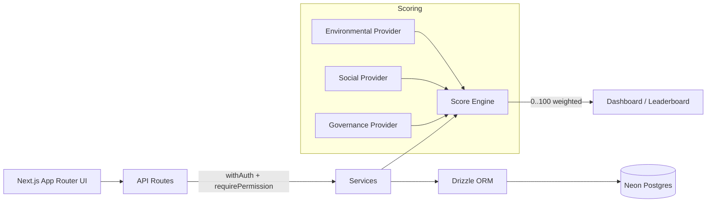

# 🌱 EcoSphere — ESG Management Platform

EcoSphere unifies **environmental data**, **employee action**, and **gamified engagement** into a single system of record, topped with a live **department ESG score**. Built for the Odoo Hackathon 2026.

## The problem it solves

Most organizations track ESG in scattered spreadsheets: carbon in one file, CSR sign-ups in another, policy sign-offs in email, audits in a PDF. There's no single score, no accountability loop, and no incentive for employees to participate. EcoSphere makes ESG **operational** — every carbon entry, CSR participation, policy acknowledgement, and challenge feeds one weighted department score, and employees earn XP, badges, and rewards for acting sustainably.

**Demo in one line:** approve a participation → watch the ESG score move.

## Key features

- **ESG scoring engine** — a `ScoreProvider` fan-in aggregates environmental, social, and governance signals per department, weighted (0.4 / 0.3 / 0.3) into a 0–100 score.
- **Gamification loop** — challenges and CSR activities award **XP** (lifetime, drives levels + leaderboard) and **points** (spendable on rewards); badges auto-award at XP/challenge thresholds.
- **RBAC** — six roles (Admin, ESG Manager, HR Manager, Auditor, Compliance Officer, Employee) with a per-entity create/read/update/delete/approve permission matrix.
- **Governance & compliance** — policies with acknowledgements, audits with owner-assigned, due-dated compliance issues (overdue flagging).
- **4 standard reports** — Environmental, Social, Governance, ESG Summary.

## Platform-wide fixes & improvements

A full-platform hardening pass addressed correctness, access control, and UX across every module.

### Cross-cutting

- **Role-based access, end to end** — the server permission matrix (`src/server/permissions.ts`) and the client affordance helpers (`src/lib/roles.ts`) were realigned to the DB role enum so every create/edit/delete/approve action is gated consistently in both the API and the UI. Viewers without rights get read-only detail views instead of dead buttons.
- **Edit works everywhere** — fixed the Next.js 15 async `params` regression in dynamic API routes (`await ctx.params`), which had been silently breaking edit **and** delete on every `[id]` route.
- **Delete works everywhere** — `delete` permissions were aligned to each entity's `update` role set, resolving spurious 403s.
- **New records appear first** — added `createdAt` timestamps to the 8 tables that lacked a time column, and every list now orders newest-first.
- **Image proof — upload & view** — a refreshed proof control lets users attach an image (stored as a data URL) and view it in-place; wired into the challenge flow and other applicable modules.
- **No more silent failures** — mutations now go through `apiFetch`, which throws on non-2xx so errors surface as toasts instead of vanishing.

### Module-specific

| Area | Fix |
|------|-----|
| Carbon Transactions | New entries now appear in the list immediately |
| Product ESG Profiles | Category selection updates linked data correctly |
| CSR Activities | "Could not join" (403) fixed — self-service join opened to all roles |
| ESG Policies | "Could not acknowledge" (403) fixed — acknowledgement opened to all roles |
| Audits & Compliance Issues | Rows are clickable; non-managers get a read-only detail view |
| Categories | Edit / save fixed |
| ESG Configuration | Pillar weights save and trigger a live score recalculation |
| Notifications | Mark-as-read, mark-all-read, and error toasts |
| Profile | New profile page, reachable from the top-bar avatar |
| Challenge emails | "View challenges" CTA now resolves to the correct absolute URL |
| Environmental & ESG Summary reports | **This month / This quarter / FY26** filters now drive the charts **and** values (demo carbon data is seeded with dates spread across FY26) |

> **Upgrading an existing database:** because this pass added `createdAt` columns, re-run `npm run db:push` (additive, safe) followed by `npm run db:seed` after pulling these changes.

## Tech stack

| Layer | Technology |
|-------|-----------|
| Framework | Next.js 15 (App Router), TypeScript (strict) |
| Styling | Tailwind CSS, shadcn/ui |
| ORM | Drizzle ORM |
| Database | Neon serverless Postgres (HTTP driver) |
| Auth | Auth.js v5 (Credentials + JWT) |
| Validation | Zod |
| Data fetching | TanStack Query |
| Charts | Recharts |
| Icons | lucide-react |

## Architecture



Every API route is wrapped in `withAuth()` and gated by `requirePermission()`. Domain modules register a `ScoreProvider`; the score engine fans them in per pillar and applies the configured weights.

## Getting started

### Prerequisites

- Node.js 18+
- A [Neon](https://neon.tech) Postgres database (free tier works)

### Setup

```bash
git clone https://github.com/ShivamPatel145/EcoSphere-ESG-Management-Platform.git
cd EcoSphere-ESG-Management-Platform
npm install

# configure environment
cp .env.example .env
# edit .env and fill in:
#   DATABASE_URL  — your Neon connection string
#   AUTH_SECRET   — generate with: openssl rand -base64 32

npm run db:push    # create tables in Neon
npm run db:seed    # load demo data
npm run dev        # http://localhost:3000
```

## Login credentials

All demo accounts use the password **`demo1234`**.

| Email | Role |
|-------|------|
| admin@ecosphere.dev | ADMIN |
| esg@ecosphere.dev | ESG_MANAGER |
| hr@ecosphere.dev | HR_MANAGER |
| auditor@ecosphere.dev | AUDITOR |
| compliance@ecosphere.dev | COMPLIANCE_OFFICER |
| priya@ecosphere.dev | EMPLOYEE |
| karan@ecosphere.dev | EMPLOYEE |
| aditi@ecosphere.dev | EMPLOYEE |

## Project structure

```
src/
├── app/
│   ├── (auth)/           # sign-in
│   ├── (app)/            # protected app shell + all module routes
│   └── api/              # health, auth, module APIs
├── components/
│   ├── app-shell/        # sidebar, topbar
│   ├── shared/           # DataTable, RecordDrawer, FormField, StatusPill, ...
│   └── ui/               # shadcn primitives
├── db/                   # schema (FROZEN), client, seed
├── server/               # permissions, api-helpers, scoring engine
└── lib/                  # levels helper
```

## Team & module ownership

| Owner | Modules |
|-------|---------|
| **Shivam** | Platform, auth, RBAC, scoring, dashboard, notifications, departments, esg-config, schema |
| **Mitesh** | Environmental (emission factors, product profiles, carbon, goals) + categories |
| **Hetvi** | Social + Governance + Approval Queue |
| **Shreya** | Gamification + Reports |

Contributor workflow: rebase on `dev`, open PRs into `dev` (never `main`), conventional commits, no squash. Full agent guidance in [CLAUDE.md](./CLAUDE.md).

## Scripts

| Command | Description |
|---------|-------------|
| `npm run dev` | Start dev server |
| `npm run build` | Production build / type-check |
| `npm run start` | Start production server |
| `npm run lint` | Run ESLint |
| `npm run db:push` | Push schema to Neon |
| `npm run db:seed` | Seed demo data |

## License

MIT
